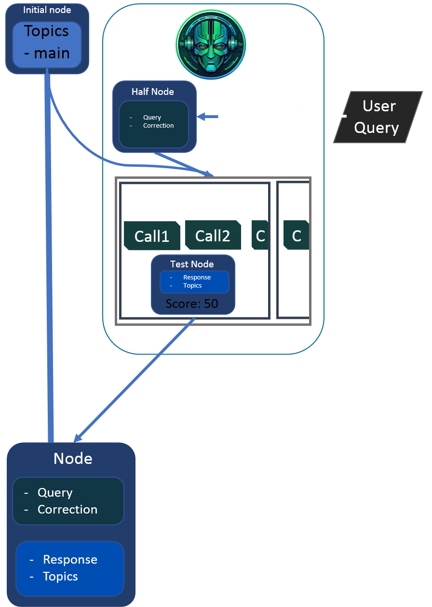

[](https://github.com/psf/black)
[](https://github.com/ken-morel/djamago/releases)
[](https://pypi.org/project/djamago)
[](https://pypi.org/project/djamago)
[](https://github.com/ken-morel/djamago/tree/mai)
[](https://coveralls.io/github/ken-morel/djamago?branch=main)
[](https://djamago.readthedocs.io)
[](https://pypi.org/project/djamago)
[](https://pypi.org/project/djamago)
[](https://pypi.org/project/djamago)
<p align="center">
    
</p>

# Djamago

Have you ever used `chatbot AI <https://pypi.org/project/chatbotAI/>`_
It is a python module for creating chatting robots.

I used chatbotai since it was extremely difficult to use ai powerred modules
like  `chatterbot <https://pypi.org/project/chatterbot/>`_ which could not
install on my pc, or trying to generate them myself using torch or tensorflow.

Djamago provides a simple, bulky but personalized approach to that
by adding support for some parsing like tools.

Djamago deeply uses `djamago <https://pypi.org/project/djamago>`_
and so will you see in the examples

## How works


### Djamago hierarchy




```python
from djamago import *


class Pango(Djamago):
    def __init__(self):
        super().__init__("pango")


@Pango.topic
@annotate
class Main(Topic):
    @Callback(
        Expression("greetings")
    )
    def morning(node: "Node", id: Values((0, 1, 2)), vars):
        if id == 0:
            node.response = "Hy"
            node.topics = ("main",)
        elif id == 1:
            node.response = node.query + ", How are you?"
            node.topics = ("greet",)
            return node
        elif id == 2:
            node.response = "How strange greetings!"
            node.topics = ("main",)
            return node
        return node

    @Callback(
        Expression('whois(".*")'),
    )
    def whois(node, id, var):
        node.response = "I do not know him/her, you tell me"
        node.topics = ("main",)
        return node

    @Callback(
        ReGex(
            [
                (0, r".*"),
            ]
        )
    )
    def hello(node, id, match):
        node.response = "Did not understand"
        node.topics = ("main",)
        return node


@Pango.topic
class Greet(Topic):
    @Callback(
        ReGex(
            [
                (0, r".*"),
            ]
        )
    )
    def dummy(node, id, match):
        node.response = "Did you know?..."
        node.topics = ("main",)
        return node

Expression.register("whois", [
    (100, r"(?:who is) (.*)"),
    (30, r"(?:do you know) (.*)"),
]);
Expression.register("name", [
    (50, r"[\w\- ]+(?: [\w\- ]+)*")
]);
Expression.register("whatis", [
    (100, r"(?:what is) (.*)"),
    (50, r"(?:tell me what is) (.*)"),
]);
Expression.register("greetings", [
    (100, r"hello"),
    (100, r"good (?:morning|evening|night|after-?noon)"),
    (20, r"good day"),
]);

p = Pango()
while True:
    print(p.respond(input("> ")).response)

```
